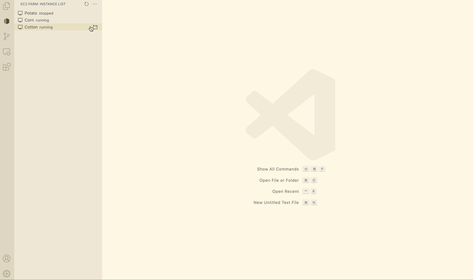
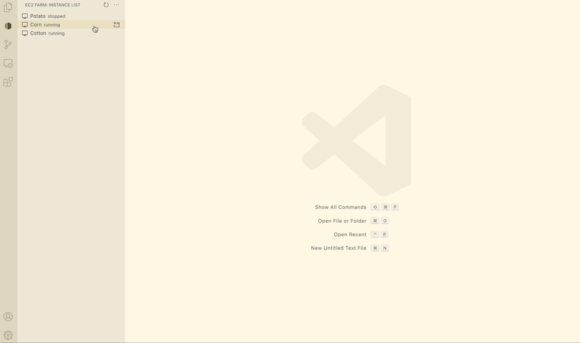
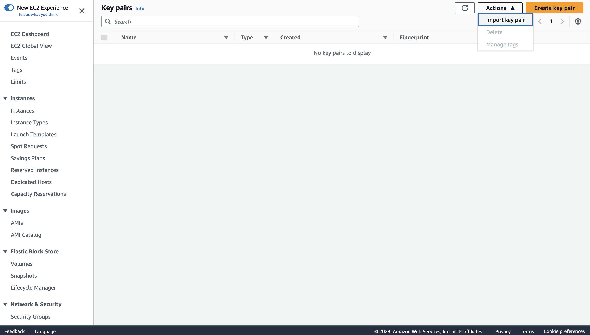
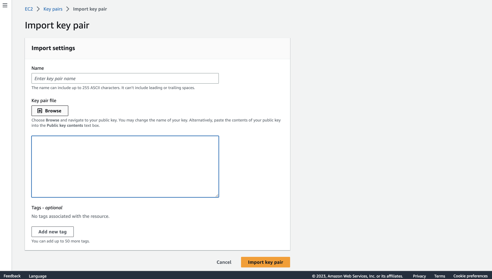

# EC2 Farm

A VSCode extension for easy remote development on EC2 instances.

## Features

**Open VSCode on EC2 instance via SSH**



**Start/Stop EC2 instances**



To add more features, please create an issue.

## Requirements

**Requirement 1: AWS access key and secret key for a user with the necessary permissions**

The following IAM permissions are required for the extension to work. Replace `<instance-arn>` with the ARN of the EC2 instance you are allowed to start/stop.

```json
{
  "Version": "2012-10-17",
  "Statement": [
    {
      "Sid": "VisualStudioCodeEC2Farm",
      "Effect": "Allow",
      "Action": [
          "ec2:DescribeInstances",
          "ec2:DescribeInstanceStatus"
      ],
      "Resource": "*"
    },
    {
      "Sid": "VisualStudioCodeEC2Farm",
      "Effect": "Allow",
      "Action": [
          "ec2:StartInstances",
          "ec2:StopInstances"
      ],
      "Resource": [
          "<instance-arn>"
      ]
    }
  ]
}
```

**Requirement 2: A provisioned and SSH-able EC2 instance.**

"**Provisioned**" means launch and terminate instance are not the scope of this extension, which should be done either manually on AWS Console or via other tools like Terraform. When you provision an EC2 instance, make sure it is "**SSH-able**", which means the instance must have a public IP address and correct SSH key pair.

To make sure the instance has a public IP address, you can either:

- Launch the instance with a public IP address (see [AWS documentation](https://docs.aws.amazon.com/AWSEC2/latest/UserGuide/using-instance-addressing.html#concepts-public-addresses)).

- Or, after the instance is launched, associate a public IP address to it (see [AWS documentation](https://docs.aws.amazon.com/AWSEC2/latest/UserGuide/using-instance-addressing.html#concepts-private-addresses)).

To generate a key pair, follow the steps below:

- On your local machine, run the following command to generate a key pair:

  ```bash
  ssh-keygen
  ```

- Import the key pair file (located at `~/.ssh/id_rsa.pub`) to AWS EC2 console.

  

  

  See the [AWS documentation](https://docs.aws.amazon.com/AWSEC2/latest/UserGuide/ec2-key-pairs.html) for more details.
